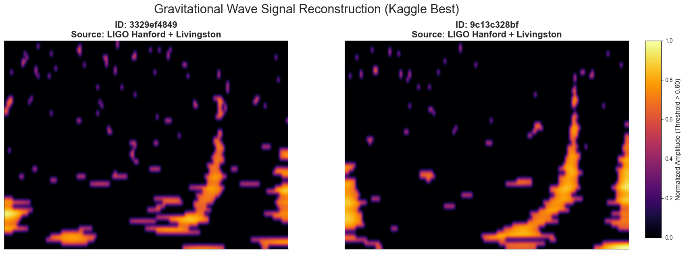
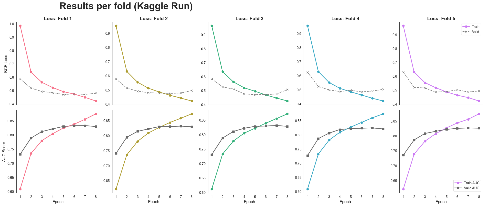
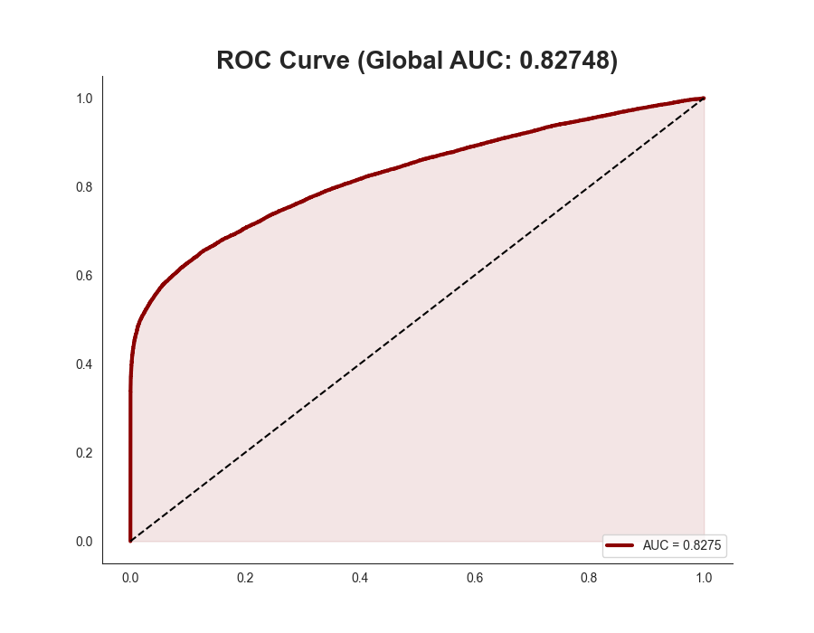

# G2Net Gravitational Wave Detection

### Primary Reference: [Kaggle Training Notebook](https://www.kaggle.com/code/stefanosolazzo/gw-final)

The full, computationally expensive training session (8 epochs on 60,000 samples) was conducted on Kaggle using Tesla P100 GPUs. **Please refer to the Kaggle notebook above as the primary proof of work and results.**

---

## Repository Overview

This repository contains a Deep Learning pipeline designed to detect gravitational wave signals from binary black hole collisions within noisy interferometric data (LIGO/Virgo). It serves as a professional, modular implementation of the Deep Learning pipeline utilized in the Kaggle solution. It is designed for:
1.  **Code Inspection:** Modularized source code (`src/`) for clarity.
2.  **Result Demonstration:** Instantly reproducing the final Kaggle plots using saved logs.
3.  **Local Reproducibility:** Running the training loop locally (requires downloading data).

The solution uses a **Constant Q-Transform (CQT)** for time-frequency conversion and an **EfficientNet-B2** CNN backbone for binary classification.



## Project Structure

```text
.
├── data/
│   └── raw/
│       ├── training_labels.csv  # Labels (Included)
│       └── train/               # Data folder (Empty by default, see Data Access)
├── outputs/
│   ├── logs/                    # Stores Kaggle results CSV and local run logs
│   └── plots/                   # Stores generated plots
├── scripts/
│   ├── train.py                 # Main training script (requires data)
│   ├── visualize.py             # Visualizes local training results
│   └── demo_kaggle_results.py   # Generates plots from Kaggle logs (no data needed for most plots)
├── src/                         # Core source code (Config, Dataset, Model)
├── pyproject.toml               # Dependency management (uv)
└── README.md
````

## Installation

This project uses **uv** for Python dependency management (Python 3.11).

1. **Install uv** (if not already installed):

    ```Bash
    curl -LsSf [https://astral.sh/uv/install.sh](https://astral.sh/uv/install.sh) | sh
    ```
    
2. **Initialize Environment:**
    
    ```Bash
    uv sync
    ```

---

## Data Access (IMPORTANT)

To keep this repository lightweight, the raw training data files (`.npy`) are **not included**.

### How to get the data:

1. **Download:** Get the `dataset_60k.zip` file from this Google Drive link: [Download Dataset (Google Drive)](https://drive.google.com/drive/folders/1gG7krxRtrr7pbcJ_vE3PlLZ96LpTV-1E?usp=sharing)
2. **Extract:** Unzip the downloaded file. You will get a folder named `train`.
3. **Place:** Move this `train` folder inside the `data/raw/` directory of this repository.
    - _Correct path check:_ You should see folders like `data/raw/train/0/`, `data/raw/train/1/`, etc.

---

## Usage Guide

### 1. Kaggle Results Demo (Recommended)

Even without downloading the raw data, you can generate the performance plots (ROC Curve, Confusion Matrix, Training Grid) based on the logs from our best Kaggle run.

```Bash
uv run scripts/demo_kaggle_results.py
```

_Note: The spectrogram plot will be skipped if the raw data is not downloaded, but the other plots will be generated in `outputs/plots/`._

### 2. Local Training Verification

**Prerequisite:** You must have downloaded and placed the data folder as described in "Data Access" above.

To verify the code runs correctly on your local machine, you can run the training script in **Debug Mode** (default). This runs a fast 2-epoch training on a small subset of 100 images.

```Bash
uv run scripts/train.py
```

Once finished, generate plots for this local run:

```Bash
uv run scripts/visualize.py
```

_(To run full training, set `DEBUG = False` in `src/config.py`, but be aware this will take many hours on a CPU)._

---

## Methodology

1. **Preprocessing:** Raw time-series waves from LIGO Hanford, LIGO Livingston, and Virgo are cleaned using a **Bandpass Filter (20-500Hz)** and converted into images using **CQT (Constant Q-Transform)**. This transforms the 1D signal processing problem into a 2D computer vision task.
    
2. **Model Architecture:** An **EfficientNet-B2** (pre-trained on ImageNet) is used as the backbone to extract features from the spectrograms.
    
3. **Training Strategy:** The model is trained using Binary Cross Entropy (BCE) loss with a Stratified K-Fold Cross-Validation strategy (5 Folds) to ensure robust generalization.



## Results

The model demonstrates strong capability in distinguishing signal from noise, achieving competitive AUC scores. The spectral whitening and CQT preprocessing steps are critical for isolating the "chirp" signal characteristic of binary black hole mergers.



**Authors:** Stefano Solazzo, Tina Rabbani, Daroui Dong